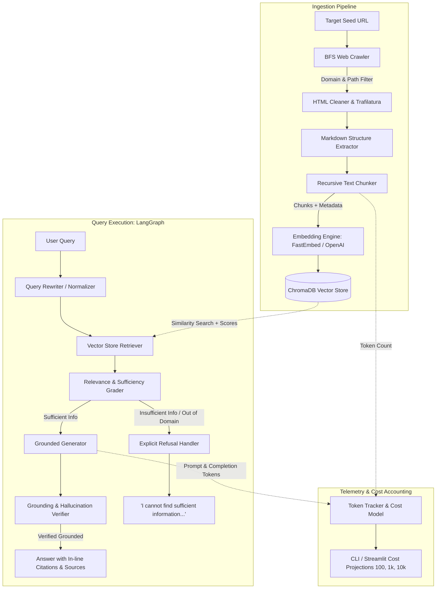
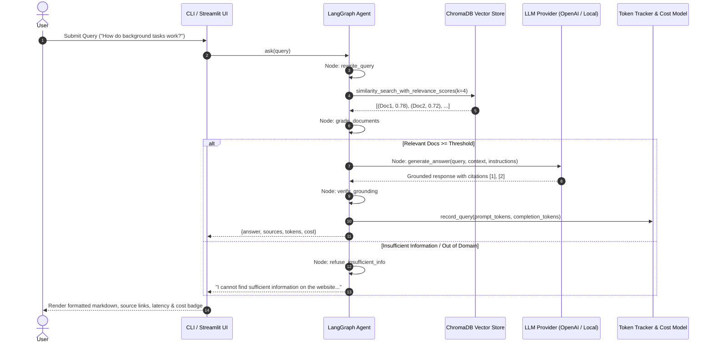

# Architecture Documentation: Website-Grounded RAG Agent

## 1. System Overview

The **Website-Grounded RAG Agent** is an end-to-end question-answering system designed to crawl technical documentation, construct a vector knowledge base, and answer queries grounded **strictly and solely** in retrieved website information.

The architecture emphasizes **verifiable grounding**, **refusal reliability for out-of-domain/misleading queries**, **deterministic token and cost accounting**, and **zero-credential offline testability**.

---

## 2. High-Level Architecture Diagram

---

## 3. Sequence Flow Diagram

---

## 4. Component Breakdown

### 4.1. Ingestion Pipeline
1. **Web Crawler (`src/crawler/crawler.py`)**:
   - Implements Breadth-First Search (BFS) starting from the seed URL.
   - Restricts crawling strictly within `ALLOWED_DOMAIN` (`fastapi.tiangolo.com`) and `URL_PATH_PREFIX` (`/tutorial/`).
   - Normalizes URLs: resolves relative links, removes fragment anchors (`#section`), cleans tracking parameters, and filters non-HTML assets (`.png`, `.pdf`, `.zip`, `.js`, etc.).
   - Employs polite crawler throttling (`CRAWL_DELAY_SECONDS = 0.2`) and custom user-agent headers.
   - Serializes crawled data to `data/crawled_pages.json` for caching and reproducible offline index builds.

2. **Content Extraction & Cleaning (`src/crawler/cleaner.py`)**:
   - Uses `trafilatura` as the primary article and documentation extraction engine. Trafilatura strips navigation sidebars, headers, footers, cookie banners, and UI chrome while preserving code blocks and markdown headings.
   - Employs a BeautifulSoup fallback with explicit CSS class removal (`md-header`, `md-sidebar`, `navbar`, etc.) for pages with unusual markup.
   - Cleans anchor artifacts (`¶`) and collapses redundant linebreaks.

3. **Text Chunking & Metadata Enrichment (`src/indexing/chunker.py`)**:
   - Utilizes `RecursiveCharacterTextSplitter` configured for markdown documents:
     - Separators: `["\n## ", "\n### ", "\n#### ", "\n\n", "\n", ". ", " "]`
     - Chunk size: `1200` characters (~300 tokens)
     - Chunk overlap: `200` characters (~50 tokens)
   - Accurately counts tokens for every chunk using `tiktoken` (`cl100k_base`).
   - Attaches structured metadata to each chunk:
     - `source`: Canonical URL
     - `title`: Page title
     - `chunk_id`: Deterministic hash ID (`url_hash-index`)
     - `token_count`: Integer token count
     - `chunk_index`: Position of chunk within page.

4. **Embedding & Vector Storage (`src/indexing/embedder.py` & `src/indexing/vectorstore.py`)**:
   - **Embedding Options**:
     - `fastembed` (Default): Uses `BAAI/bge-small-en-v1.5` (384 dimensions) running locally on CPU via ONNX Runtime. Provides zero-cost, high-speed, offline-capable dense retrieval.
     - `openai`: Uses `text-embedding-3-small` (1536 dimensions) for production OpenAI setups.
     - `mock`: Deterministic hash embeddings for fast unit testing.
   - **Vector Database**:
     - `ChromaDB` with disk persistence (`data/chromadb`).
     - Supports cosine/L2 similarity search with normalized relevance scores.

---

### 4.2. LangGraph Agent Workflow (`src/agent/graph.py`)

The core execution graph is built with **LangGraph**:

1. **`rewrite_query`**: Formulates an optimized keyword/semantic search query if the input query is conversational or syntactically indirect.
2. **`retrieve`**: Queries the Chroma vector database for top-$k$ ($k=4$) documents with relevance scores.
3. **`grade_documents`**: Evaluates whether the retrieved context contains sufficient, relevant information.
   - If relevance scores fall below `SIMILARITY_SCORE_THRESHOLD` (0.30) or if the query triggers out-of-domain indicators, `has_sufficient_info` is set to `False`.
4. **Conditional Edge (`route_sufficiency`)**:
   - If `has_sufficient_info` is `True` $\to$ route to `generate_answer`.
   - If `has_sufficient_info` is `False` $\to$ route to `refuse_insufficient_info`.
5. **`generate_answer`**:
   - Synthesizes the response strictly from the formatted context.
   - Applies strict anti-hallucination prompts:
     - Every factual claim must include an inline bracketed citation (e.g. `[1]`, `[2]`).
     - Appends a markdown `### Sources` section.
     - If the context does not contain sufficient facts, outputs:
       `"I cannot find sufficient information on the website to answer this question."`
     - If a question asks about a false premise (e.g., PHP compiler, mandatory Django ORM), explicitly refutes it.
6. **`verify_grounding`**:
   - Secondary verification node checking whether the answer claims are supported by the context snippets.
7. **`refuse_insufficient_info`**:
   - Deterministic refusal node returning the required exact refusal string with empty source list.

---

### 4.3. Token Tracking & Cost Model (`src/tracking/`)

- **Real-Time Token Accounting**:
  - Tracks every prompt and completion token via `tiktoken`.
  - Captures ingestion tokens during chunking and embedding.
- **Cost Calculation**:
  - Ingestion: `(tokens / 1M) * embedding_rate_per_1M`
  - Query: `(prompt_tokens / 1M) * input_rate + (completion_tokens / 1M) * output_rate`
- **Multi-Tier Cost Projections**:
  - Automatically computes projected costs for 1, 100, 1,000, and 10,000 queries.

---

### 4.4. Multi-Interface Layer

1. **CLI (`src/cli.py`)**:
   - `crawl`: BFS crawler with progress and page stats.
   - `index`: Vector embedding and ChromaDB persistence.
   - `query`: Single-query execution with answers, sources, tokens, and cost.
   - `interactive`: REPL chat session with live token and citation stats.
   - `evaluate`: Benchmark evaluation runner with scorecard.
   - `cost-analysis`: Token usage breakdown and multi-tier scaling table.
2. **Streamlit App (`app.py`)**:
   - Full interactive web interface with chat, evaluation runner, cost calculator, and knowledge base browser.
